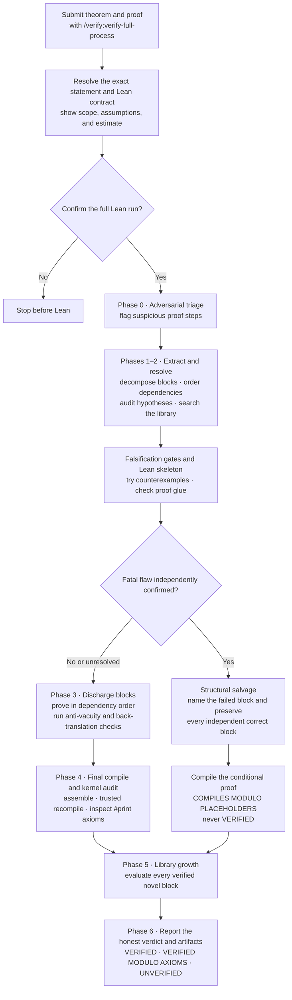
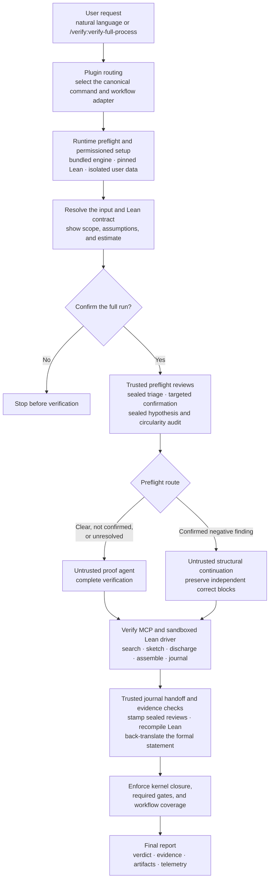

# Verify Harness

A standalone verification system built around the exact Claude workflows in
`.claude/commands/`. The router chooses a command; the harness enhances it with
runtime setup, persistence, sealed audits, trusted recompilation, and the
bundled `RLGeneralization` Lean library.

## Install and invoke in Claude Code — no clone required

Install the plugin:

```bash
claude plugin marketplace add https://github.com/jin-yidan/verify-harness.git
claude plugin install verify@verify
```

Restart the agent, then either ask naturally:

```text
Try to falsify this theorem first.
Check whether this proof satisfies every hypothesis.
Fully verify this theorem and proof in Lean.
```

or call an exact packaged Claude command:

```text
/verify:verify-falsify
/verify:verify-full-process
/verify:verify-hypothesis-audit
```

Run `/help` in Claude Code to see every packaged command. Claude Code
namespaces marketplace commands with the plugin name, so direct invocation
uses `/verify:<command>` rather than the repo-local `/verify-<command>` form.

The plugin routes natural language to the same canonical command specifications
and adds the harness safeguards around them. It installs its bundled engine
into isolated user data after asking permission and never fetches another
Verify repository. A first full Lean check may still download the pinned Lean
toolchain and upstream Mathlib dependencies.

## Install in Codex

```bash
codex plugin marketplace add jin-yidan/verify-harness --ref main
codex plugin add verify@verify
```

## Full verification flow

`/verify:verify-full-process` follows the canonical phases below. Triage and
audits guide scrutiny but do not decide the result without independent
evidence.



`VERIFIED` requires the saved certificate to compile again under the trusted
parent, an acceptable kernel axiom closure, a matching back-translation, and
complete required gates. `COMPILES MODULO PLACEHOLDERS` certifies conditional
proof structure only; it never upgrades the theorem to `VERIFIED`. A confirmed
counterexample to the complete theorem yields `UNVERIFIED/WRONG`; a refuted
proof step yields `UNVERIFIED/PROOF_INVALID` and does not by itself show that
the theorem is false.

## Plugin harness flow

The plugin wraps the canonical command with runtime management and a trusted
parent harness. The proof agent can construct Lean evidence through MCP, but it
cannot author the sealed audit records or the final trusted verdict.



The trusted runner is the verdict boundary: an agent-side compile alone cannot
produce `VERIFIED`. Provider failures, missing gates, or incomplete evidence
are reported without being promoted to a mathematical conclusion.

## Run from a clone

Requirements: Python 3.10 or newer and Lean through `elan`.

```bash
python3 -m venv .venv
.venv/bin/python -m pip install -e ".[pdf]"
lake update SLT
bash scripts/prepare_slt.sh
lake exe cache get
lake build RLGeneralization
(cd tools/repl && lake build repl)
```

Examples:

```bash
.venv/bin/python -m rlverify retrieve "Bellman contraction"
.venv/bin/python -m rlverify falsify --example ucb_mutated
.venv/bin/python -m harness verify path/to/proof --backend codex --report
```

Canonical commands live in `.claude/commands/`. Byte-identical convenience
copies live in `commands/`, in the plugin's `commands/`, and in its bundled
runtime. Check them with:

```bash
python3 scripts/sync_command_surfaces.py --check
```

Standalone Codex adaptations are in `codex-skills/`; the installable
cross-agent plugin is in `plugins/verify/`.
